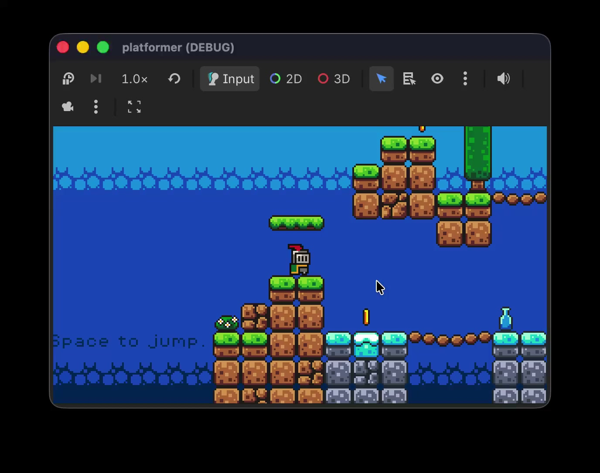

*GitHub does not show an embedded video player in README files. Click the image or open [gameplay.mp4](gameplay.mp4) to watch in the browser.*

# Notes

## Sprites & world building

- **Sprite sheet** — When you pack all sprites into a single PNG file, that image is called a sprite sheet.
- **TileMap** — You build a 2D world with a TileMap. You can add multiple layers to one TileMap so you can separate midground, background, and similar depth.
- **AnimatableBody2D** — Use this for moving physics bodies, for example moving platforms.

## Animation & interaction

- **AnimationPlayer** — You add animations here, often as property tracks with keyframes.
- **Area2D** — Lets you detect overlaps and collisions involving areas (e.g. triggers, pickups).
- **Signals** — Emit and connect signals for notifications across the game, similar in spirit to Swift’s `NotificationCenter`.

## Physics layers

- **Collision layer** — Which layer(s) this body or area *is* on.
- **Collision mask** — Which layer(s) it *interacts* with.

## Scene flow & timing

- `get_tree().reload_current_scene()` — Restarts the current scene from the beginning. Useful for a game over → reload loop.
- `delta` — Time in seconds since the previous frame (use in `_process` / `_physics_process` for frame-rate–independent motion).

## UI & pixel art

- **Font size** — For pixel-art games, prefer font sizes that are multiples of **8** so text stays crisp; arbitrary sizes often look blurry or uneven.
 
## Nodes & scenes

- `Node` — The simplest node type; it has no 2D transform (no position, scale, or size in the 2D sense). (`Node2D` adds position, rotation, and scale.)
- **Unique nodes** — If you mark a node as unique in the editor, you can reference it from the same scene without a long path using `%NodeName`, for example: `@onready var game_manager = %GameManager`.
- **Autoloads (globals)** — **Project → Project Settings → Globals** — Register scripts or scenes that stay alive for the whole game, independent of the current scene. Somewhat like a lightweight service locator or DI-style registry.

## Pickups & lifecycle

- **Coin pickup pattern** — An `AnimationPlayer` sequence can be used not for “showy” animation but as a **timeline**: hide the coin, play a sound, then remove the node. You can also **invoke methods** from the animation timeline (method tracks); that is how you typically call `queue_free()` at the right moment. For that kind of flow, relying on a `Timer` is often **not** the recommended approach.
- `tree_exited` **/** `on_tree_exited()` — Runs when the node leaves the tree; after `queue_free()`, this is one way to know the node is really gone from the scene.

## Scripting & paths

- `$` **shorthand** — Same as `get_node()`. Example: `$Player/Weapon` is equivalent to `get_node("Player/Weapon")`.
- `@export var some_node: Node` — Exposes a slot in the inspector so you can assign a node from the editor, similar in idea to `@IBInspectable` in UIKit.
- `class_name` — Gives a script a global class name you can use throughout the project.

## GDScript warnings (project settings)

These options live in **`project.godot`** under **`[debug]`** (editor path: **Project → Project Settings → Debug → GDScript**). They control how the analyzer treats potential mistakes. Severity is stored as a number: **`0`** = ignore, **`1`** = warn, **`2`** = error.

### Why enable stricter settings?

The goal is **safer, more maintainable scripts**: catch typing and API misuse **before** runtime, keep types **explicit** where it matters, and avoid “silent” bugs from discarded return values or forgotten `await`. It is similar in spirit to stricter checks in languages like Swift—GDScript is still dynamic, but the editor can enforce a **disciplined** style across the whole project.

### This project’s values

| Setting | Level | What it does |
|--------|--------|----------------|
| `untyped_declaration` | **Error** | Disallows untyped `var` / parameters where the project expects explicit types (or consistent typing rules). |
| `inferred_declaration` | **Error** | Flags declarations that rely only on inference when the project wants explicit annotations for clarity and tooling. |
| `unsafe_property_access` | **Error** | Warns when you read/write a property on a value the type system cannot prove safe (e.g. `Variant`-like paths). |
| `unsafe_method_access` | **Error** | Same idea for method calls on insufficiently known types. |
| `unsafe_cast` | **Error** | Flags casts that may fail at runtime if the value is not the assumed type. |
| `unsafe_call_argument` | **Error** | Flags passing values into calls where the argument type does not match safely. |
| `return_value_discarded` | **Warn** | If a function returns a meaningful value (e.g. error codes, nodes), ignoring it is flagged—helps avoid ignored errors. |
| `missing_await` | **Warn** | If you call something that should be `await`ed (async flow) without `await`, you get a reminder. |

**Summary:** The first six are set to **error** so the codebase stays **typed and safe** at analysis time; the last two stay **warnings** so you get nudges without necessarily blocking every build on style-heavy cases.

**Note:** Preferences under **Editor → Editor Settings → Text Editor → GDScript** (theme, completion, etc.) are **user-local** and are **not** stored in this repo—only **Project Settings** entries in `project.godot` are shared with the project.

## Architecture

- **Call down, signal up** — Prefer calling methods on children from parents, and notifying parents (or the rest of the tree) with **signals** going upward. For **sibling** communication, still use signals and let a **parent** coordinate.
- **Inner classes** — GDScript supports inner classes.
- **Inheritance** — GDScript does **not** support multiple inheritance; favor **composition** over deep inheritance hierarchies.
